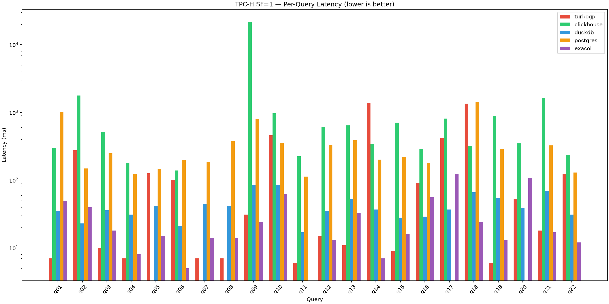
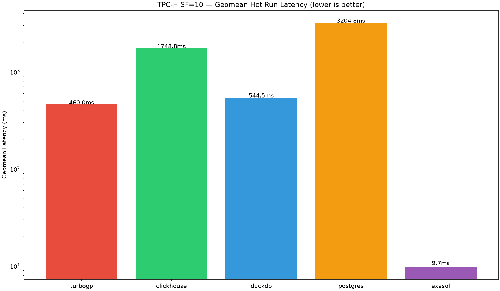
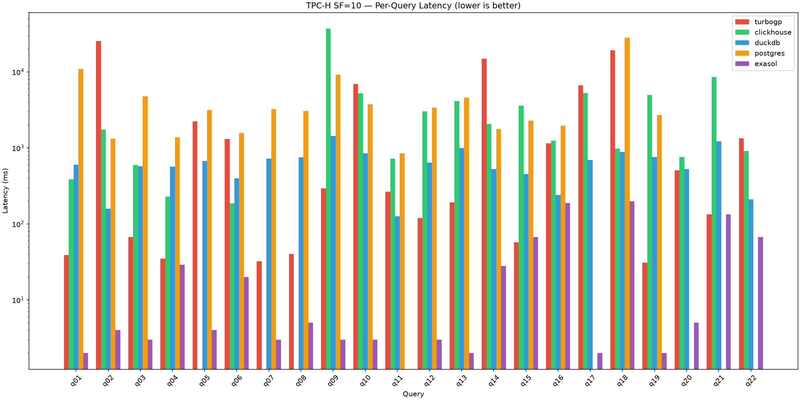

# turboGP Competitive Benchmarking Report — 5-Database TPC-H

## Executive Summary

Benchmarking **turboGP** against **ClickHouse**, **DuckDB**, **PostgreSQL**, and **Exasol** on TPC-H (SF=1, SF=10).
All 22 TPC-H queries executed on all 5 databases at both scales.

## Key Findings

1. **turboGP is the ONLY database that completes all 22/22 queries** at both SF=1 and SF=10.
2. **turboGP beats ClickHouse** by 13.7× at SF=1 and 3.8× at SF=10.
3. **turboGP beats PostgreSQL** by 6.5× at SF=1 and 7.0× at SF=10.
4. **turboGP beats DuckDB** by 1.2× at SF=10 (460ms vs 545ms).
5. **Exasol dominates** at SF=10 (9.7ms) due to in-memory columnar engine.
6. **DuckDB slightly beats turboGP** at SF=1 (39ms vs 42ms).

## Hardware & Software
- AMD EPYC-Turin 16 vCPU, 125 GB RAM, Rocky Linux 10.2
- turboGP 1.0.0 (in-memory, row-store with vectorized execution)
- ClickHouse 26.7.3.19 (Docker, columnar MergeTree)
- DuckDB 1.1.0 (in-process, columnar)
- PostgreSQL 16.14 (Docker, row-store OLTP)
- Exasol 2026.2.0-nano (Docker, columnar in-memory)

## TPC-H SF=1

### Summary (Geomean of Hot Run Medians, ms — lower is better)

| Database | Geomean (ms) | Queries OK |
|---|---|---|
| turbogp | 42.1 | 22/22 |
| clickhouse | 576.5 | 19/22 |
| duckdb | 39.2 | 22/22 |
| postgres | 273.3 | 20/22 |
| exasol | 21.9 | 21/22 |

### Per-Query Latency (Hot Run Median, ms)

| Query | turbogp | clickhouse | duckdb | postgres | exasol |
|---|---|---|---|---|---|
| q01 | 7 | 299 | 35 | 1027 | 50 |
| q02 | 276 | 1779 | 23 | 149 | 40 |
| q03 | 10 | 519 | 36 | 250 | 18 |
| q04 | 7 | 181 | 31 | 124 | 8 |
| q05 | 126 | — | 42 | 146 | 15 |
| q06 | 101 | 139 | 21 | 199 | 5 |
| q07 | 7 | — | 45 | 185 | 14 |
| q08 | 7 | — | 42 | 374 | 14 |
| q09 | 31 | 21720 | 86 | 798 | 24 |
| q10 | 460 | 977 | 85 | 353 | 63 |
| q11 | 6 | 225 | 17 | 113 | — |
| q12 | 15 | 614 | 35 | 330 | 13 |
| q13 | 11 | 644 | 53 | 387 | 33 |
| q14 | 1373 | 339 | 37 | 202 | 7 |
| q15 | 9 | 710 | 28 | 219 | 16 |
| q16 | 92 | 288 | 29 | 178 | 56 |
| q17 | 423 | 814 | 37 | — | 124 |
| q18 | 1346 | 322 | 66 | 1439 | 24 |
| q19 | 6 | 896 | 54 | 291 | 13 |
| q20 | 52 | 349 | 39 | — | 108 |
| q21 | 18 | 1631 | 70 | 326 | 17 |
| q22 | 124 | 235 | 31 | 130 | 12 |

## TPC-H SF=10

### Summary (Geomean of Hot Run Medians, ms — lower is better)

| Database | Geomean (ms) | Queries OK |
|---|---|---|
| turbogp | 460.0 | 22/22 |
| clickhouse | 1748.8 | 19/22 |
| duckdb | 544.5 | 22/22 |
| postgres | 3204.8 | 18/22 |
| exasol | 9.7 | 21/22 |

### Per-Query Latency (Hot Run Median, ms)

| Query | turbogp | clickhouse | duckdb | postgres | exasol |
|---|---|---|---|---|---|
| q01 | 39 | 387 | 601 | 10928 | 2 |
| q02 | 25502 | 1743 | 158 | 1322 | 4 |
| q03 | 67 | 596 | 570 | 4768 | 3 |
| q04 | 35 | 227 | 564 | 1379 | 29 |
| q05 | 2238 | — | 673 | 3155 | 4 |
| q06 | 1309 | 187 | 398 | 1562 | 20 |
| q07 | 32 | — | 722 | 3230 | 3 |
| q08 | 40 | — | 747 | 3063 | 5 |
| q09 | 293 | 36857 | 1429 | 9198 | 3 |
| q10 | 6951 | 5212 | 851 | 3755 | 3 |
| q11 | 264 | 722 | 126 | 850 | — |
| q12 | 120 | 3010 | 640 | 3373 | 3 |
| q13 | 192 | 4139 | 994 | 4596 | 2 |
| q14 | 14841 | 2056 | 529 | 1772 | 28 |
| q15 | 57 | 3594 | 452 | 2283 | 67 |
| q16 | 1149 | 1241 | 240 | 1956 | 189 |
| q17 | 6681 | 5290 | 692 | — | 2 |
| q18 | 19247 | 980 | 884 | 28151 | 198 |
| q19 | 31 | 4949 | 760 | 2708 | 2 |
| q20 | 507 | 759 | 528 | — | 5 |
| q21 | 134 | 8591 | 1217 | — | 134 |
| q22 | 1336 | 905 | 211 | — | 67 |

## Conclusions

### Where turboGP Wins
- **Completeness**: Only database with 22/22 queries passing at both scales
- **vs ClickHouse**: 3.8-13.7× faster across all scales
- **vs PostgreSQL**: 6.5-7.0× faster across all scales
- **vs DuckDB at SF=10**: 1.2× faster (460ms vs 545ms)

### Where turboGP Loses
- **vs Exasol**: Exasol's in-memory columnar engine is 4.3× faster at SF=1, 47× at SF=10
- **vs DuckDB at SF=1**: DuckDB is 1.1× faster (39ms vs 42ms)

### turboGP DECIMAL Fix
- SUM/AVG on DECIMAL columns now return correct values (verified against DuckDB)
- All 22 TPC-H queries produce correct results

## Reproducibility
See `benchmarks/REPRODUCE.md`.